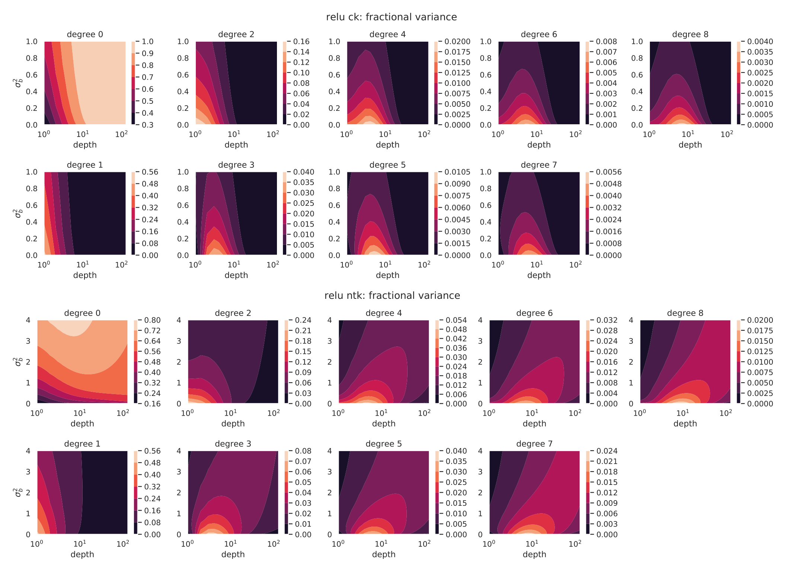
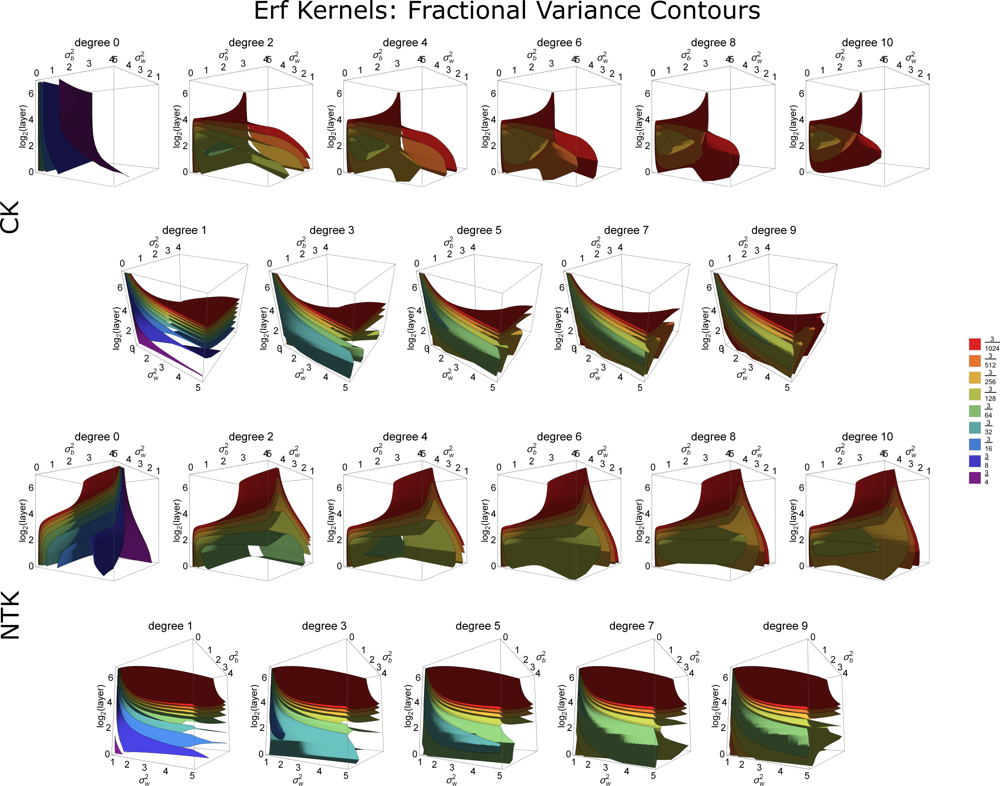

# A Fine-Grained Spectral Perspective on Neural Networks

This repo is a companion to the paper

[**A Fine-Grained Spectral Perspective on Neural Networks**](https://arxiv.org/abs/1907.10599) 
*Greg Yang and Hadi Salman*

It serves several purposes
- It overviews the results of the paper in two self-contained jupyter noteboks (see *[Neural Network Generalization](NeuralNetworkGeneralization.ipynb)* and *[Clarifying Simplicity Bias](ClarifyingSimplicityBias.ipynb)*).
For most of the potential users of this repo, we recommend reading one of them to start.
They have overlapping content in the part of overviewing the paper's theoretical results.
- It contains the computational tools (`theory.py`) contributed by the paper for computing eigenvalues of [neural tangent kernel](http://arxiv.org/abs/1806.07572) and [conjugate kernel](http://papers.nips.cc/paper/6427-toward-deeper-understanding-of-neural-networks-the-power-of-initialization-and-a-dual-view-on-expressivity.pdf) (or [NNGP kernel](http://arxiv.org/abs/1711.00165)) over the boolean cube, and also examples for how to use them (see any of the notebooks).
- It contains a dump of plots describing how the different hyperparameters such as depth and initialization scheme conspire to change the kernels (see *[The Complete Hyperparameter Picture](TheCompleteHyperparameterPicture.ipynb)*).

